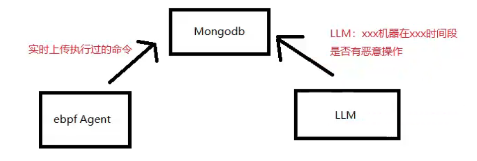

# ebpfExecDB MCP Server

一款MCP（Model Context Protocol）的Server程序，通过clientAgent中的ebpf程序记录执行的命令，并使用MongoDB存储，最后通过LLM访问DB来判断研判这些命令。




### Features

- 可通过自然语言查询Mongodb

- ebpf监听syscall__execve事件并记录

- 可用LLM总结某个时间内所有执行的操作

- 密码验证MCP访问权限


### Installation

```bash
cd ebpfExecDB
uv pip install fastmcp
uv pip -r requirements.txt
```

安装完成后可在本地MCP设置文件(如claude_desktop_config.json)写入如下内容：

```json
{
  "mcpServers": {
    "ebpfExecDB": {
      "type": "stdio",
      "command": "uv",
      "args": [
        "run",
        "--directory",
        "/Users/test/MCPSecurity/ebpfExecDB",
        "--with",
        "fastmcp",
        "fastmcp",
        "run",
        "/Users/test/MCPSecurity/ebpfExecDB/ebpfExecDB.py"
      ],
      "env": {
        "MONGO_URI": "mongodb://localhost:27017",
        "DATABASE_NAME": "execMcpSecurity",
        "QUERY_KEY": "admin888"
      }
    }
  }
}
```

### Debugging

```bash
uv run --with fastmcp fastmcp dev ebpfExecDB.py
```

### Things to Note

本项目旨在学习MCP开发过程创建的Demo，并不具备完善的功能。

### LICENSE

MIT License - see LICENSE file for details.
